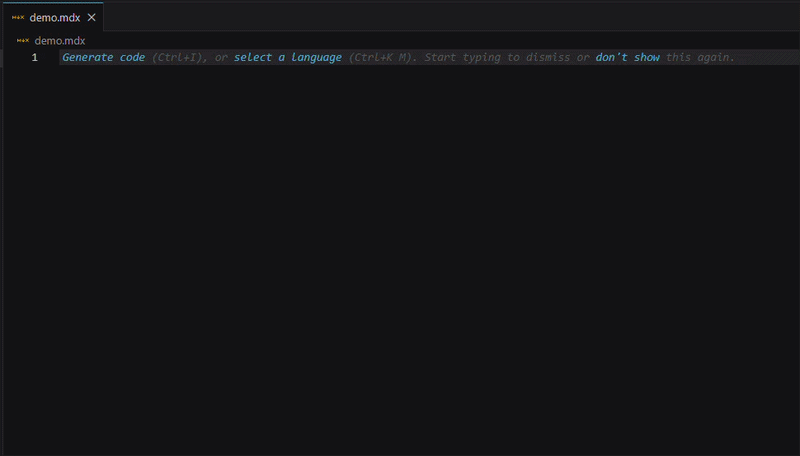

# Fern Snippets (unofficial)

Rich autocomplete and hover documentation for [Fern](https://buildwithfern.com) MDX components in VS Code.

> **Unofficial extension** — community-built.



---

## Features

**Rich autocomplete** — type `fern-card` or `<Card` and the popup shows the component description, a props table, a usage example, and a link to the Fern docs.

**Two trigger styles** — use whichever feels natural:
- `fern-` prefix → `fern-card`, `fern-callout`, `fern-steps` …
- `<` JSX trigger → `<Card`, `<Callout`, `<Steps` …

**Hover documentation** — hover over any Fern tag already in your document to see its full reference inline.

**40 components covered** — every component in the Fern catalog, across callouts, cards, tabs, steps, code blocks, accordions, tables, API reference embeds, and more.


---

## Install

Download the latest `fern-snippets-0.3.0.vsix` from the [Releases page](https://github.com/craigashields/fern-snippets/releases/latest).

**Option A — VS Code UI:**

1. Open the Extensions panel (`Ctrl+Shift+X` / `Cmd+Shift+X`)
2. Click the `...` menu in the top-right of the panel
3. Select **Install from VSIX...**
4. Choose the downloaded `.vsix` file

**Option B — Command line:**

```
code --install-extension fern-snippets-0.3.0.vsix
```

---

## Usage

In any `.mdx` or `.md` file, start typing a trigger and select from the autocomplete dropdown. Press `Tab` to accept and move between placeholders. Props with fixed values (like `intent` or `cols`) show a choice dropdown at their tab stop.

Snippets include required props and the most commonly used optional ones. For the full prop reference, hover over any component tag or follow the "View docs →" link in the autocomplete popup.

---

## Components

### Callouts

| Trigger | Component | Description |
|---|---|---|
| `fern-callout` | `<Callout>` | Callout with intent dropdown (8 options) and optional title |
| `fern-note` | `<Note>` | Note callout |
| `fern-info` | `<Info>` | Info callout |
| `fern-warning` | `<Warning>` | Warning callout |
| `fern-success` | `<Success>` | Success callout |
| `fern-error` | `<Error>` | Error callout |
| `fern-tip` | `<Tip>` | Tip callout |
| `fern-check` | `<Check>` | Check callout |
| `fern-launch` | `<Launch>` | Launch / announcement callout |

### Cards, Tabs, Steps

| Trigger | Component | Description |
|---|---|---|
| `fern-card` | `<Card>` | Card with title, icon, href, and content |
| `fern-cardgroup` | `<CardGroup>` | CardGroup with cols dropdown (2/3/4) and two Card children |
| `fern-tabs` | `<Tabs>` | Tabs with two Tab children |
| `fern-steps` | `<Steps>` | Steps with three Step children |

### Code

| Trigger | Component | Description |
|---|---|---|
| `fern-code` | fenced code block | Fenced code block with language dropdown (12 options) and title |
| `fern-codeblock` | `<CodeBlock>` | CodeBlock JSX with deep link support |

### Accordion and Frame

| Trigger | Component | Description |
|---|---|---|
| `fern-accordion` | `<Accordion>` | Accordion with title and content |
| `fern-accordiongroup` | `<AccordionGroup>` | AccordionGroup with two Accordion children |
| `fern-frame` | `<Frame>` | Frame with caption and image |

### Inline

| Trigger | Component | Description |
|---|---|---|
| `fern-badge` | `<Badge>` | Badge with intent dropdown (8 options) |
| `fern-button` | `<Button>` | Button with intent dropdown (5 options), href, and label |
| `fern-icon` | `<Icon>` | Font Awesome icon by name |
| `fern-copy` | `<Copy>` | Click-to-copy with optional custom clipboard text |
| `fern-tooltip` | `<Tooltip>` | Hover info on trigger content |
| `fern-anchor` | `<Anchor>` | Linkable anchor for non-heading content |

### Layout

| Trigger | Component | Description |
|---|---|---|
| `fern-aside` | `<Aside>` | Sticky right-side container |
| `fern-indent` | `<Indent>` | Indented / hierarchical content |
| `fern-download` | `<Download>` | File download with button trigger |
| `fern-if` | `<If>` | Show content conditionally by product, version, or role |
| `fern-prompt` | `<Prompt>` | Copyable AI prompt card with open-in actions |

### Tables

| Trigger | Component | Description |
|---|---|---|
| `fern-table` | markdown table | Standard 3-column, 2-row markdown table |
| `fern-sticky-table` | `<StickyTable>` | Table with sticky header row |
| `fern-searchable-table` | `<SearchableTable>` | Table with real-time search filter |

### Files and Structure

| Trigger | Component | Description |
|---|---|---|
| `fern-files` | `<Files>` | Interactive file tree with folders and files |

### API Reference

| Trigger | Component | Description |
|---|---|---|
| `fern-endpoint-request` | `<EndpointRequestSnippet>` | Embed API request code snippet |
| `fern-endpoint-response` | `<EndpointResponseSnippet>` | Embed API response code snippet |
| `fern-endpoint-schema` | `<EndpointSchemaSnippet>` | Embed API schema with selector dropdown |
| `fern-runnable-endpoint` | `<RunnableEndpoint>` | Interactive API request builder |
| `fern-schema` | `<Schema>` | Display type definition from API reference |
| `fern-paramfield` | `<ParamField>` | Document an API parameter with type and description |

### Versioning

| Trigger | Component | Description |
|---|---|---|
| `fern-versions` | `<Versions>` | Show different content based on version selection |

---

## Component docs

Full Fern component reference: [buildwithfern.com/learn/docs/writing-content/components/overview](https://buildwithfern.com/learn/docs/writing-content/components/overview)
